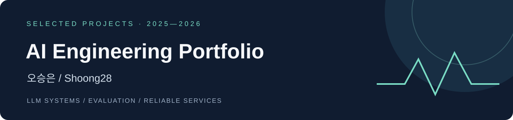

# 오승은 | AI 엔지니어 포트폴리오

**도메인의 문제를 LLM 시스템으로 설계하고, 평가와 안전장치를 갖춘 서비스로 구현합니다.**

교육·접근성 분야의 세 프로젝트에서 사용자 문제 정의부터 AI 개발, 평가, 서비스 통합을 경험했습니다.  
자연어 이해와 생성은 LLM에 맡기고, 사실 검증과 상태 전이는 코드가 책임지도록 설계합니다.

[GitHub 프로필](https://github.com/Shoong28) · [모르미 상세](projects/mormi.md) · [편해질지도 상세](projects/barrier-free-travel.md) · [수학 평가 상세](projects/math-assessment.md)

---

## 프로젝트 한눈에 보기

| 프로젝트 | 해결한 문제 | 나의 핵심 기여 | 주요 결과 |
|:--|:--|:--|:--|
| **01 · 아이엠쌤 / 모르미** 2026 · SKT FLY AI | 느린학습자의 실패 부담과 생활 수학 학습 | AI 대화 엔진, 교육 상태 모델, 발화·힌트 정책, API·배포 | 20명 현장 파일럿에서 자기효능감 **1.62 → 2.18**, 정답률 **42% → 61%** 관찰 |
| **02 · 편해질지도** 2026 · TECH4GOOD | 이동약자가 직접 확인해야 하는 경로·접근성 정보 | 대중교통·저상버스 통합, 자연어 온보딩, 비동기 상태·캐시 개선 | **TECH4GOOD 해커톤 우수상** · 실데이터 기반 접근성 안내 |
| **03 · 교육과정 정합 수학 평가** 2025.03–2025.10 · 3인 졸업프로젝트 | 서술형 풀이의 공정한 채점과 학습 피드백 | 루브릭·부분점수 채점, 파인튜닝 데이터, LLM-as-a-Judge 평가 | 이진 채점 정확도 **81.67% → 93.89%** · 졸업프로젝트 **A+** |

> 아래의 ‘나의 기여’는 개인 담당 범위입니다. 수상·파일럿·프로토타입은 팀 프로젝트의 결과이며, 수치의 평가 조건은 각 상세 페이지에 정리했습니다.

## 01 · 아이엠쌤 — AI 동생을 가르치며 배우는 생활 수학

**LLM 대화 설계 · 결정형 상태 관리 · 실제 사용자 검증**

느린학습자가 AI 동생 ‘모르미’에게 수학을 설명하며 배우는 서비스입니다. 현장 인터뷰를 통해 교과 복습 중심 초기안을 돈 계산 등 생활 자립 수학으로 전환했습니다.

### 나의 기여

- **AI 대화 시스템 전반 설계·개발:** 발화 이해 → 교육적 판단 → 응답 생성의 책임을 분리하고, 학습 상태와 완료 여부를 결정형 로직으로 관리했습니다.
- **부분 성공을 기억하는 상태 모델:** 답·방법·근거를 독립적으로 누적해, 이미 맞힌 내용을 반복해서 묻지 않도록 설계했습니다.
- **서로 다른 어려움에 맞춘 지원:** 표현을 돕는 발화사다리와 개념을 돕는 힌트사다리의 정책을 설계했습니다.
- **검증과 서비스 운영:** 정답 선공개·근거 없는 칭찬을 제한하고, API·상태 저장·멱등 요청·테스트·배포를 담당했습니다.

**검증 결과** — 2026.08.28 대안학교 학생 20명의 동일 집단 당일 사전·사후 파일럿에서 자기효능감(3점 척도)은 1.62 → 2.18, 정답률은 42% → 61%로 상승했습니다. 대조군 없는 소규모 파일럿의 관찰 결과입니다.

`Python` `FastAPI` `LangGraph` `Claude` `Pydantic` `PostgreSQL` `Docker` `AWS`

**[프로젝트 상세 →](projects/mormi.md)** · [원본 저장소](https://github.com/flyai-y2s2/Mormi-AI) · [아키텍처](https://github.com/flyai-y2s2/Mormi-AI/blob/develop/docs/ARCHITECTURE.md) · [API 명세](https://github.com/flyai-y2s2/Mormi-AI/blob/develop/docs/API_SPEC.md)

---

## 02 · 편해질지도 — 이동 가능성과 불확실성을 함께 안내하는 여행

**외부 API 통합 · 규칙과 LLM의 결합 · 실패 상황 설계**

휠체어 이용자·고령자·유모차 동반 가족이 장소의 접근성과 실제 이동 경로를 함께 확인할 수 있는 무장애 여행 서비스입니다.

### 나의 기여

- **대중교통·실시간 저상버스 파이프라인:** ODsay와 TAGO의 서로 다른 정류소 ID를 좌표·이름·노선으로 연결하고, 서울 BIS 어댑터를 적용했습니다.
- **자연어 출발지 온보딩:** 규칙 기반 매칭을 먼저 수행하고 실패한 입력만 Claude로 처리했습니다. 반환 ID를 실제 후보와 재검증하고 실패 시 기존 선택 흐름으로 복귀하도록 했습니다.
- **실데이터 기반 계단 감지:** 동일 구간의 일반·계단 제외 경로 응답을 비교해 `facilityType=17` 신호를 발견하고 파서·난이도·경고에 반영했습니다.
- **캐시와 화면 상태 정합성:** 장애 폴백의 캐시 잔류, 늦게 도착한 응답의 화면 덮어쓰기, 중복 요청을 방어하고 모바일 지도 UX를 개선했습니다.

**팀 성과** — 2026.07.16 TECH4GOOD 해커톤 우수상(SK텔레콤·하나금융그룹). ‘정보 없음’을 ‘접근 가능’이나 ‘일반 버스’로 단정하지 않는 안내 흐름을 구현했습니다.

`Python` `FastAPI` `React` `Claude` `Tmap` `ODsay` `TAGO` `서울 BIS`

**[프로젝트 상세 →](projects/barrier-free-travel.md)** · [원본 저장소](https://github.com/Shoong28/barrier-free-travel) · [출발지 매칭](https://github.com/Shoong28/barrier-free-travel/blob/main/backend/app/services/matcher.py) · [저상버스 통합](https://github.com/Shoong28/barrier-free-travel/blob/main/backend/app/services/tago.py)

---

## 03 · 교육과정 정합 수학 평가 — 정답뿐 아니라 채점 근거까지 검증

**루브릭 기반 채점 · 파인튜닝 · LLM 평가와 오류 분석**

중학교 교육과정에 맞춘 문항 생성·검증부터 서술형 채점·피드백까지 연결한 평가 시스템입니다. 저는 채점 기준 생성, 부분점수 채점, 피드백 및 평가 파이프라인을 맡았습니다.

### 나의 기여

- **성취기준을 채점 기준으로 구조화:** 특정 풀이 순서를 강제하지 않는 평가 요소와 배점을 설계했습니다.
- **과정 중심 부분점수 채점:** 최종 답의 정오답과 풀이 점수를 분리하고, 기준별 충족 여부에 따라 점수를 부여했습니다.
- **데이터 구축·모델 개선:** 채점 기준 예제 50건, 채점 파인튜닝 데이터 538건, 평가 답안 360건을 구축했습니다.
- **근거까지 검증하는 평가:** o4-mini 기반 LLM-as-a-Judge로 채점의 수학적·논리적 적절성을 평가하고 오류를 5개 유형으로 분석했습니다.

**실험 결과** — 이진 채점 정확도 81.67% → 93.89%(+12.22%p), 부분점수 채점 적절성 63.89% → 77.50%(+13.61%p). 졸업프로젝트 A+, 관련 논문 JIIS 투고·심사 진행 중(2026.09 기준).

`Python` `OpenAI API` `Prompt Engineering` `Fine-tuning` `LLM-as-a-Judge` `pandas`

**[프로젝트 상세 →](projects/math-assessment.md)** · [원본 저장소](https://github.com/CapstoneProject-2/curriculum-aligned-math-assessment) · [채점 모듈](https://github.com/CapstoneProject-2/curriculum-aligned-math-assessment/tree/main/src/grading) · [프롬프트](https://github.com/CapstoneProject-2/curriculum-aligned-math-assessment/tree/main/prompts)

---

## 세 프로젝트를 관통하는 개발 원칙

| 원칙 | 적용 사례 |
|:--|:--|
| **LLM과 코드의 책임을 나눕니다.** | 모르미의 교육 상태 전이, 출발지 후보 ID 재검증 |
| **결과와 함께 근거를 검증합니다.** | 수학 채점 근거 평가, 아이 발화의 원문 근거 추적 |
| **실패와 결측도 제품의 상태로 설계합니다.** | 저상버스 확인 불가, API 폴백, 대화 재시도·복구 |
| **사용자의 실제 문제로 돌아갑니다.** | 현장 인터뷰에 따른 생활 수학 전환, 이동약자의 환승·도보 부담 반영 |

이 저장소는 세 프로젝트를 소개하는 포트폴리오입니다. 소스 코드와 실행 안내는 각 원본 저장소에서 확인할 수 있습니다. 개인 기여·성과는 본인의 프로젝트 기록을 바탕으로 작성했으며, 공개 구현 링크는 2026.09.30 기준으로 확인했습니다.
