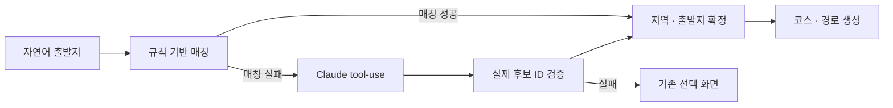

[← 포트폴리오](../README.md)

# 편해질지도 · Barrier-free Travel

> 이동약자가 실제로 갈 수 있는 경로를 찾고, 확인할 수 없는 정보도 명확하게 안내했습니다.

**2026 · TECH4GOOD 해커톤 · 팀 삼박자**  
**팀 성과:** 2026.07.16 우수상(SK텔레콤·하나금융그룹)  
**담당:** 대중교통·저상버스 파이프라인, 자연어 출발지 온보딩, 데이터·상태 정합성, 모바일 지도 UX

[GitHub](https://github.com/Shoong28/barrier-free-travel)

## 해결한 문제

이동약자의 여행은 장소 선택만으로 끝나지 않습니다. 계단·승강설비·저상버스 여부를 여러 서비스에서 확인해야 합니다. 팀은 장소 추천과 이동 경로를 연결한 웹 서비스를 개발했고, 저는 경로의 데이터 통합과 실제 사용 흐름의 신뢰성을 높이는 작업을 맡았습니다.

## 1. 서로 다른 교통 데이터 연결

ODsay의 정류소 ID를 TAGO에 그대로 사용할 수 없어 **좌표·이름·노선**을 활용한 후보 탐색을 구현했습니다.

- 정류소명 유사도와 거리를 기준으로 후보를 정렬하고, 최대 4개 후보에서 실제 노선 도착정보를 확인했습니다.
- 노선명에 붙은 기점 표현을 제거하고, 가상 정류소·차고지 후보를 제외했습니다.
- TAGO가 지원하지 않는 서울은 별도 BIS 어댑터로 처리했습니다.
- 도착정보가 없으면 ‘일반 버스’로 단정하지 않고 확인 불가 상태를 유지했습니다.
- 실시간 도착정보와 정적 경로 캐시를 분리하고 조회 시간 예산을 두었습니다.

**결과:** 첫 번째 근접 정류소에 도착정보가 없는 경우에도 다른 후보를 탐색하고, 실시간 부가정보 실패가 전체 경로 조회를 중단시키지 않도록 했습니다.

## 2. 규칙 기반 처리와 LLM을 결합한 온보딩

‘세종’이 ‘종로’로, ‘인천공항’이 ‘제주공항’으로 잘못 매칭되는 사례를 분석했습니다. 사용자 입력과 후보 데이터의 정규화 방식을 분리하고, 짧은 후보 제외·지역 충돌 검증을 적용했습니다. 구조화 출력 이후에도 도메인 검증이 필요하다는 점을 반영한 설계입니다.

## 3. 실데이터로 계단 신호 확인

동일 구간의 Tmap 일반 경로와 계단 제외 경로를 비교하면서, 안내점뿐 아니라 구간의 `facilityType=17`에 계단 신호가 있음을 확인했습니다. 이를 파서·난이도·지도 경고에 연결했습니다.

당시 수원 팔달문 → 팔달공원 응답에서는 일반 경로 **672m·9분**, 계단 제외 경로 **1,519m·20분**을 확인했습니다. 이는 당시 API 응답을 비교한 사례이며, 현재 경로를 보장하는 수치는 아닙니다.

## 4. 실패와 비동기 상태를 다루는 방식

| 문제 | 적용한 해결 |
|:--|:--|
| 일시 장애의 직선 폴백이 캐시에 남음 | 폴백 경로를 캐시하지 않아 다음 요청에서 복구 시도 |
| 경로는 성공했지만 표고 조회만 실패 | 기존 폴리라인으로 표고만 재평가 |
| 늦게 도착한 응답이 최신 선택을 덮음 | 증가형 요청 토큰으로 최신 응답만 반영 |
| 온보딩과 화면 effect에서 중복 요청 | 가드로 직접 실행과 effect의 중복 방어 |
| 일부 구간만 측정됐는데 전체처럼 보임 | 부분 측정 상태를 별도로 표현 |

모바일에서는 경로 옵션 퀵바, 필터별 결과 개수, 우회 채택·미채택 사유를 표시해 사용자가 결과를 해석할 수 있도록 했습니다.

## 코드에서 확인할 부분

| 확인할 내용 | 구현 |
|:--|:--|
| 규칙 우선 매칭과 LLM 후보 검증 | [matcher.py](https://github.com/Shoong28/barrier-free-travel/blob/main/backend/app/services/matcher.py) |
| 교통 경로와 실시간 저상버스 | [transit.py](https://github.com/Shoong28/barrier-free-travel/blob/main/backend/app/services/transit.py) · [tago.py](https://github.com/Shoong28/barrier-free-travel/blob/main/backend/app/services/tago.py) |
| 계단 신호와 경로 처리 | [tmap.py](https://github.com/Shoong28/barrier-free-travel/blob/main/backend/app/services/tmap.py) |
| 경로 API와 화면 상태 | [route.py](https://github.com/Shoong28/barrier-free-travel/blob/main/backend/app/routers/route.py) · [App.jsx](https://github.com/Shoong28/barrier-free-travel/blob/main/frontend/src/App.jsx) |

**검증 범위:** 구현과 당시 실데이터·스모크 확인에 근거합니다. 출발지 매칭의 정량 정확도와 자동화된 응답 경합 테스트 결과는 별도로 제시하지 않습니다. 연결된 저장소는 팀 프로젝트의 개인 계정 포크입니다.

**배운 점:** API를 연결하는 것만큼 서로 다른 데이터의 의미와 결측을 정확하게 다루는 일이 중요했습니다. ‘확인할 수 없음’을 명시하는 것도 제품의 핵심 기능입니다.

---
[포트폴리오 첫 화면으로 →](../README.md)
