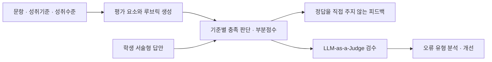

[← 포트폴리오](../README.md)

# LLM 기반 수학 서술형 문항 생성 및 채점 시스템

> 정오답 판정을 넘어, 풀이 과정과 채점 근거의 적절성을 평가했습니다.

**2025.03–2025.10 · 3인 졸업프로젝트**  
**담당:** 채점 기준 생성·부분점수 채점·피드백 설계, 파인튜닝 데이터 구축, 성능 평가 및 오류 분석  
**팀 성과:** 졸업프로젝트 A+ · JIIS 논문 투고·심사 진행 중(2026.09 기준)

[GitHub](https://github.com/CapstoneProject-2/curriculum-aligned-math-assessment) · [실행 안내](https://github.com/CapstoneProject-2/curriculum-aligned-math-assessment/blob/main/src/grading/README.md)

## 문제와 담당 범위

수학 서술형 답안은 최종 답이 같더라도 풀이의 완전성과 개념 이해가 다릅니다. 이진 정오답 판정만으로는 이를 충분히 반영할 수 없고, 결론이 맞더라도 채점 근거에 수학적 오류가 있을 수 있습니다.

팀은 문항 생성·검증부터 채점·피드백까지 이어지는 시스템을 개발했습니다. 저는 그중 **성취기준을 채점 가능한 루브릭으로 변환하고, 학생 풀이를 평가해 다음 학습을 돕는 모듈**을 담당했습니다.

## 내가 설계한 파이프라인

### 루브릭과 부분점수

특정 풀이 절차를 강제하는 대신 성취 목표를 중심으로 평가 요소를 정의했습니다. 각 기준은 하나의 행동을 평가하며, 충족 여부에 따라 배점을 부여하도록 구성했습니다. 최종 답의 정오답과 풀이 점수를 분리해 과정 중심 평가를 지원했습니다.

### 데이터 구축과 모델 개선

| 데이터 | 규모 | 구성 |
|:--|--:|:--|
| 채점 기준 생성 예제 | 50건 | 모델 초안 생성 후 직접 검수·수정 |
| 채점 파인튜닝 데이터 | 538건 | 학생 답안과 모범 채점 결과 구성·검수 |
| 평가 답안 | 360건 | 9개 단원 × 10문제 × 정답·오답 답안 각 2개 |

프롬프트와 파인튜닝을 비교하고, 계산 도구 도입도 실험했습니다. 계산 도구가 응답 복잡도와 풀이 흐름 오해를 늘리는 사례를 확인해 최종 채점 흐름에서 제외했습니다.

### 근거까지 평가하는 LLM-as-a-Judge

o4-mini를 평가자로 사용해 채점 결과의 수학적·논리적 적절성을 검수했습니다. 오류는 **연산 실수, 개념 이해 오류, 학생 풀이 흐름 오해, 오개념 미식별, 채점 기준 적용 오류**로 구분해 개선 지점을 찾았습니다.

피드백은 정답 여부와 풀이의 강점·오류를 반영하되, 정답과 공식을 직접 제공하지 않고 재도전을 유도하는 짧은 힌트로 설계했습니다.

## 실험 결과와 해석

| 지표 | 결과 | 의미 |
|:--|:--|:--|
| 채점 정확도 | **81.67% → 93.89%** | 정오답 판정 정확도, **+12.22%p** |
| 채점 근거 적절성 | **63.89% → 77.50%** | Judge의 적절 판정 비율, **+13.61%p** |

두 수치는 서로 다른 평가 지표입니다. 채점 근거 적절성을 정오답 정확도와 동일하게 해석하지 않았습니다. 실험 수치는 본인의 프로젝트 기록에 근거하며, 원시 결과 파일은 공개 저장소에 포함되어 있지 않습니다. 평가자 역시 LLM이므로 사람 평가와 동일하다고 가정하지 않습니다.

## 코드에서 확인할 부분

| 확인할 내용 | 구현·자료 |
|:--|:--|
| 채점 기준 생성 | [generate_rubrics.py](https://github.com/CapstoneProject-2/curriculum-aligned-math-assessment/blob/main/src/grading/generate_rubrics.py) |
| 학생 답안 채점 | [run_prompt_grading.py](https://github.com/CapstoneProject-2/curriculum-aligned-math-assessment/blob/main/src/grading/run_prompt_grading.py) |
| 피드백 생성 | [run_feedback.py](https://github.com/CapstoneProject-2/curriculum-aligned-math-assessment/blob/main/src/grading/run_feedback.py) |
| Judge 평가 | [run_judge_evaluation.py](https://github.com/CapstoneProject-2/curriculum-aligned-math-assessment/blob/main/src/grading/run_judge_evaluation.py) |
| 재현 가능한 프롬프트와 조건 | [prompts](https://github.com/CapstoneProject-2/curriculum-aligned-math-assessment/tree/main/prompts) · [configs](https://github.com/CapstoneProject-2/curriculum-aligned-math-assessment/tree/main/configs) |
| 지표 산출 방식 | [results/README.md](https://github.com/CapstoneProject-2/curriculum-aligned-math-assessment/blob/main/results/README.md) |

**배운 점:** 교육 AI의 품질은 정답률로만 판단하기 어렵습니다. 학생이 받은 점수뿐 아니라 그 점수의 근거가 타당한지 확인하는 평가 체계가 필요했습니다.

---
[포트폴리오 첫 화면으로 →](../README.md)
