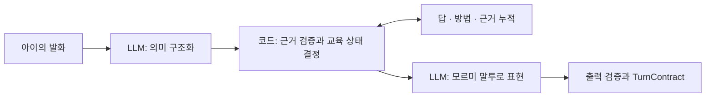

[← 포트폴리오](../README.md)

# 아이엠쌤 · Mormi AI

> 아이가 AI 동생을 가르치는 경험을, 일관된 교육 상태와 검증 가능한 대화로 구현했습니다.

**2026 · SKT FLY AI 해커톤 · 팀 프로젝트**  
**담당:** AI 대화 시스템 설계·개발, 발화·힌트 정책, API·상태 저장·테스트·배포

[GitHub](https://github.com/flyai-y2s2/Mormi-AI) · [아키텍처](https://github.com/flyai-y2s2/Mormi-AI/blob/develop/docs/ARCHITECTURE.md) · [API](https://github.com/flyai-y2s2/Mormi-AI/blob/develop/docs/API_SPEC.md)

## 문제 정의와 전환

초기에는 정규 교과 내용을 복습하는 서비스를 구상했습니다. 하지만 느린학습자 대안학교 관계자 인터뷰에서 교과 진도를 따라가는 것보다 돈 계산 등 생활 자립 역량이 더 절실하다는 사실을 확인했습니다. 이를 바탕으로 집에서 익힌 수학을 카페·놀이공원 과제에서 사용하는 구조로 전환했습니다.

저는 ‘서툰 AI 동생을 아이가 가르친다’는 핵심 아이디어를 제안하고, 평가받는 부담을 줄이면서 아이의 실제 설명을 학습 성취로 연결하는 대화 시스템을 설계했습니다.

## 핵심 설계

| 기술적 문제 | 내가 적용한 해결 |
|:--|:--|
| LLM이 판단과 말투를 동시에 맡아 교육 원칙이 흔들림 | 자연어 이해·교육 판단·발화를 분리하고, 상태 전이와 완료는 코드가 소유 |
| 답은 맞혔지만 설명이 부족하면 같은 질문 반복 | 답·방법·근거 슬롯을 독립적으로 누적하고 미해결 초점만 질문 |
| 표현의 어려움과 개념의 어려움을 같은 오답으로 취급 | 발화사다리와 힌트사다리를 독립 축으로 설계 |
| 아이가 말하지 않은 풀이를 AI가 학습 기록에 추가 | 원문 근거를 검증하고 직접 설명과 공동 수행의 성취 귀속 분리 |
| 재시도·새로고침으로 대화가 중복 진행 | 멱등 요청, 대화 스냅샷, 저장된 상태를 통한 복구 |

## 내 역할과 협업 경계

**직접 담당:** 모르미의 교육·대화 원칙, AI 대화 엔진, 부분 성공 상태 모델, 발화·힌트사다리 개념과 대화 정책, 정답 유출·오개념 강화 방지, 콘텐츠·화면 계약, AI API·저장·배포 및 현장 피드백 반영.

**팀원 담당:** 서비스 프론트엔드, Spring 백엔드, 발화사다리 시작 단계 예측 모델, 교사용 분석 리포트. 발화사다리의 개념·정책 설계와 별도 예측 모델 구현을 구분했습니다.

## 현장 검증

2026년 8월 28일, 대안학교 고등학생 **20명**을 대상으로 동일 집단의 당일 사전·서비스 사용·사후 측정을 진행했습니다.

| 지표 | 사용 전 | 사용 후 | 기록된 검정 결과 |
|:--|--:|--:|:--|
| 자기효능감 평균 · 3점 척도 | 1.62 | 2.18 | Wilcoxon, p < .001 |
| 문제 정답률 | 42% | 61% | Wilcoxon, p = .003 |

학교 측의 지속적 수업 활용 및 유료 전환 후 사용 의향도 확인했습니다. 이는 **소규모·대조군 없는 당일 파일럿**의 관찰 결과로, 장기 효과나 인과관계를 입증한 결과로 해석하지 않았습니다. 수치는 프로젝트 당시 본인 기록에 근거하며, 공개 저장소의 테스트 결과와는 구분됩니다.

## 코드에서 확인할 부분

| 확인할 내용 | 구현·문서 |
|:--|:--|
| 교육 흐름과 상태 전이 | [dialogue_v2_graph.py](https://github.com/flyai-y2s2/Mormi-AI/blob/develop/src/mormi_api/dialogue_v2_graph.py) |
| 검증된 답·방법·근거 누적 | [dialogue_v2_ledger.py](https://github.com/flyai-y2s2/Mormi-AI/blob/develop/src/mormi_api/dialogue_v2_ledger.py) |
| 모르미 발화 생성 | [dialogue_v2_speaker.py](https://github.com/flyai-y2s2/Mormi-AI/blob/develop/src/mormi_api/dialogue_v2_speaker.py) |
| 대화 서비스와 저장 | [service.py](https://github.com/flyai-y2s2/Mormi-AI/blob/develop/src/mormi_api/service.py) · [repository.py](https://github.com/flyai-y2s2/Mormi-AI/blob/develop/src/mormi_api/repository.py) |
| 계약·회귀 검증 | [tests](https://github.com/flyai-y2s2/Mormi-AI/tree/develop/tests) · [화면 계약](https://github.com/flyai-y2s2/Mormi-AI/blob/develop/docs/VISUAL_CONTRACTS.md) |

**배운 점:** 자연스러운 대화는 문장을 잘 생성하는 것만으로 완성되지 않습니다. 사용자가 이미 해낸 것을 정확히 기억하고, 다음 행동을 일관되게 결정하는 상태 모델이 필요했습니다.

---
[다음 프로젝트: 편해질지도 →](barrier-free-travel.md)
