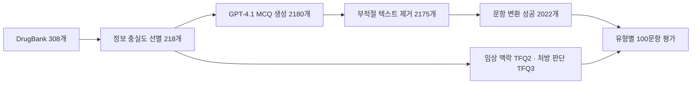

[← 포트폴리오](../README.md)

# 의약품 도메인 LLM 평가 데이터 구축 연구

> 어떤 지식을 어떤 문항으로 평가할지 정의하고, 데이터 생성부터 응답 분석까지 연결했습니다.

**2025.04–2025.06 · UROP 연구**  
**성과:** 2025 디지털 바이오헬스 종합설계 경진대회 심사위원상  
**수행:** 원천 데이터 선별, 합성 문항 생성·변환·정제, 모델·프롬프트 비교, 지표 설계·분석

[코드 저장소](https://github.com/Shoong28/pharma-llm-evaluation) · [실행 안내](https://github.com/Shoong28/pharma-llm-evaluation/blob/main/docs/REPRODUCTION.md)

## 1. 평가할 능력에서 데이터 요건을 정의

객관식 정답률만으로는 복수 정답 선택, 타인의 답 검토, 임상 상황 판단을 구분하기 어렵다고 보았습니다. 모델·프롬프트·문항 유형을 교차 비교하고, 오류가 출력 형식 때문인지 답변 내용 때문인지 나누어 분석하는 평가를 설계했습니다.

## 2. 원천 데이터의 정보 충실도 확인

DrugBank ATC 신경계(N) 의약품 308개를 대상으로 약물명·설명·작용기전·약력학·적응증·영향 생물체·독성의 7개 필드를 선정했습니다. 약물명을 포함해 최소 5개 필드가 채워진 **218개**를 남겼습니다. 데이터 수를 늘리는 것보다 문항 생성에 필요한 근거가 충분한지 먼저 확인했습니다.

## 3. 합성·변환과 품질 정제

| 단계 | 수행 내용 |
|:--|:--|
| MCQ 합성 | 의약품당 10개, 총 2,180개 생성 |
| 텍스트 정제 | HTML 등 부적절한 텍스트 5문항 제외, 2,175개 확보 |
| 유형 변환 | MAQ·TFQ·RQ 구성, 변환 실패 153개 제외 |
| 타겟 문항 확장 | 병력·병용 약물 맥락의 TFQ2, 처방 적절성 TFQ3 추가 |
| 라벨 구성 | 참·거짓 판단 문항의 정답 비율 균형 고려 |

기본 네 문항 유형과 일부 변환 코드는 MultifacetEval을 참고·수정했습니다. 독자 기여는 DrugBank 데이터 선별과 의약품 문항 생성, 임상 문항 추가, 비교 실험 및 분석 흐름입니다. [기존 코드 고지](https://github.com/Shoong28/pharma-llm-evaluation/blob/main/THIRD_PARTY_NOTICES.md)

## 4. 90개 조건의 응답 평가

- 모델: GPT-4o, GPT-5, GPT-4o-mini, medicine-chat-7B, Llama3-Med42-70B
- 프롬프트: AO, CoT, CoVe
- 문항: MCQ, MAQ, RQ, TFQ, TFQ2, TFQ3
- 규모: 5 × 3 × 6 × 100 = **9,000개 응답**
- 로컬 모델: medicine-chat 8-bit, Med42 4-bit 양자화

**Strict Accuracy**는 형식 오류를 포함한 전체 응답 기준이며 복합 문항의 부분 정답을 인정하지 않았습니다. **Valid Metrics**는 파서가 유효하다고 판정한 응답에서 계산했습니다. MAQ는 선지별 이진 판단, RQ는 타인의 답에 대한 판단과 올바른 선지 선택으로 나누었습니다.

## 5. 결과와 해석

| 관찰 | 수치 | 해석 |
|:--|:--|:--|
| CoT와 AO | 82.17% vs 75.80% | CoT가 +6.37%p |
| CoVe와 CoT | 81.50% vs 82.17% | 추가 검증이 평균 성능을 높이지 않음 |
| 모델별 최고 평균 | GPT-4o 91.00% | 의료 특화 여부만으로 성능을 예측하기 어려움 |
| TFQ2와 TFQ | 89.40% vs 74.87% | 서로 다른 문항 집합에서 14.53%p 차이 관찰 |

이 결과는 당시 벤치마크와 설정에 한정됩니다. TFQ2와 TFQ의 차이를 맥락 하나만의 인과 효과로 해석하지 않습니다. 유효 응답 성능은 파싱 규칙과 표본 선택의 영향을 받습니다. 원래 파서의 느슨한 문자 매칭 등 한계도 실행 안내에 기록했습니다.

## 코드에서 확인할 부분

| 과정 | 코드 |
|:--|:--|
| 원천 데이터 파싱·결측 분석 | [data_drug](https://github.com/Shoong28/pharma-llm-evaluation/tree/main/data_drug) |
| MCQ 생성 | [generate_mcq.ipynb](https://github.com/Shoong28/pharma-llm-evaluation/blob/main/generate_question/generate_mcq.ipynb) |
| 임상·처방 문항 생성 | [generate_tfq2.py](https://github.com/Shoong28/pharma-llm-evaluation/blob/main/generate_question/generate_tfq2.py) · [generate_tfq3.py](https://github.com/Shoong28/pharma-llm-evaluation/blob/main/generate_question/generate_tfq3.py) |
| API·로컬 모델 응답 생성 | [generate_answer](https://github.com/Shoong28/pharma-llm-evaluation/tree/main/generate_answer) |
| 지표와 혼동행렬 | [analyze_performance.py](https://github.com/Shoong28/pharma-llm-evaluation/blob/main/evaluation/analyze_performance.py) |

**공개·검증 범위:** 코드와 연구 당시 집계 수치를 공개했습니다. 원천 데이터·전체 생성 문항과 응답·모델 가중치·인증키는 포함하지 않습니다. 이번 공개 정리에서는 기존 분석 노트북 출력과 연구 기록을 대조했으며 모델 실험을 재실행하지 않았습니다.

**학습 데이터 업무로 연결되는 경험:** 타겟 능력 정의, 도메인 근거 선별, 합성 문항 품질 정제, 오류별 분석을 수행했습니다. 이 프로젝트는 평가 데이터 구축이며 SFT 학습이나 데이터 구성별 ablation 학습을 수행한 것으로 서술하지 않습니다.

---
[다음 프로젝트: 수학 파인튜닝 데이터·평가 →](math-assessment.md)
